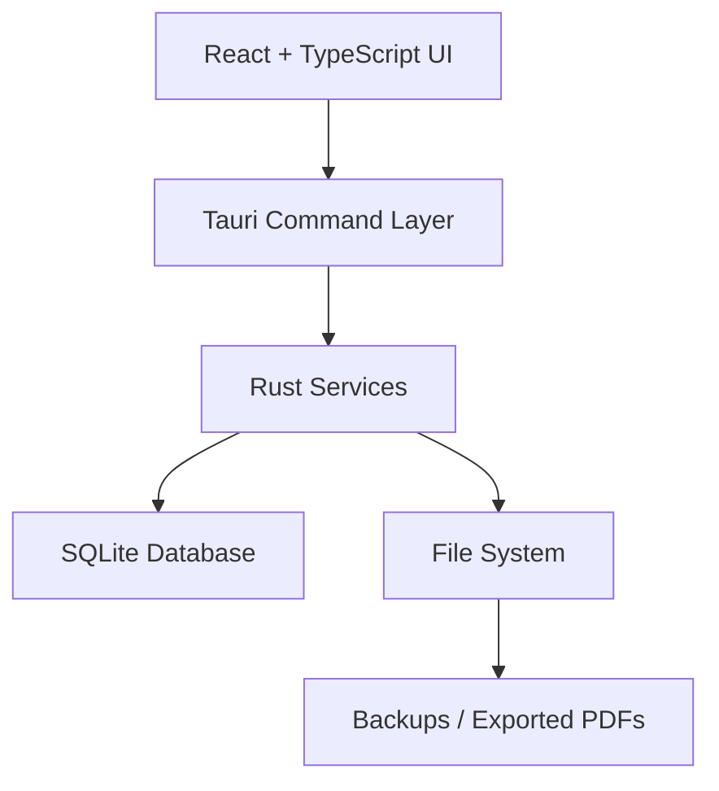
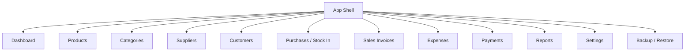
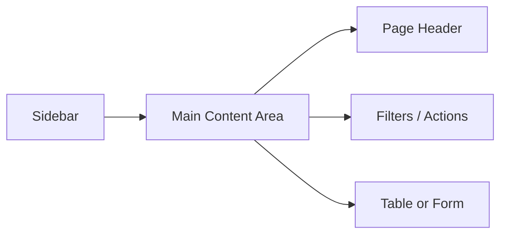
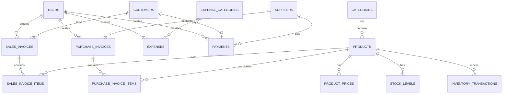
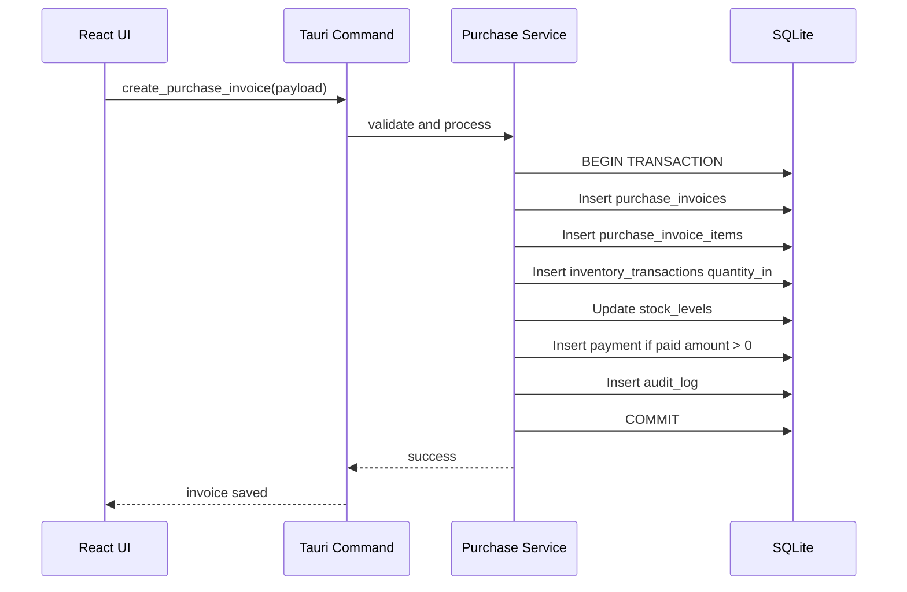
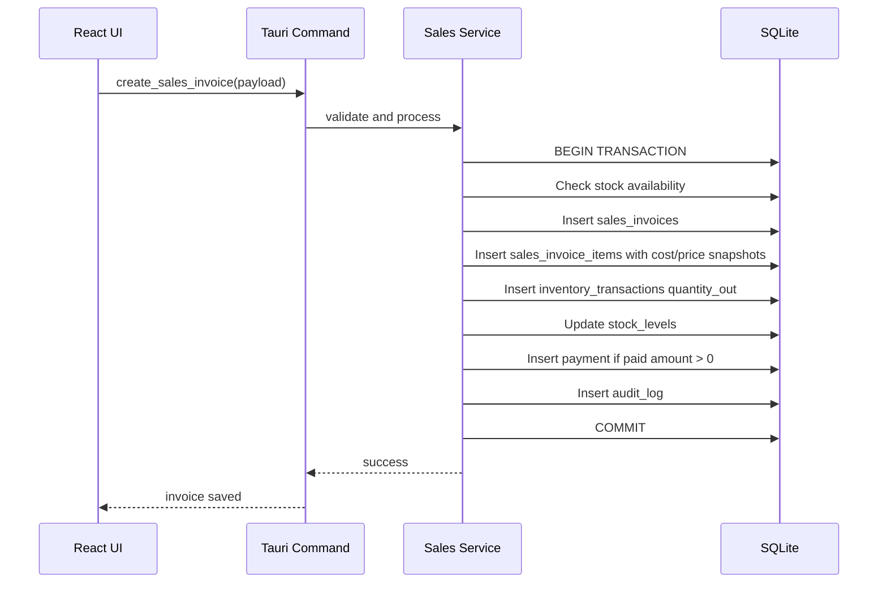
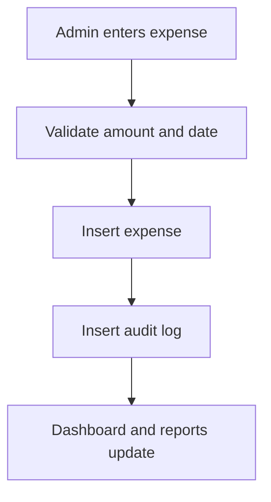
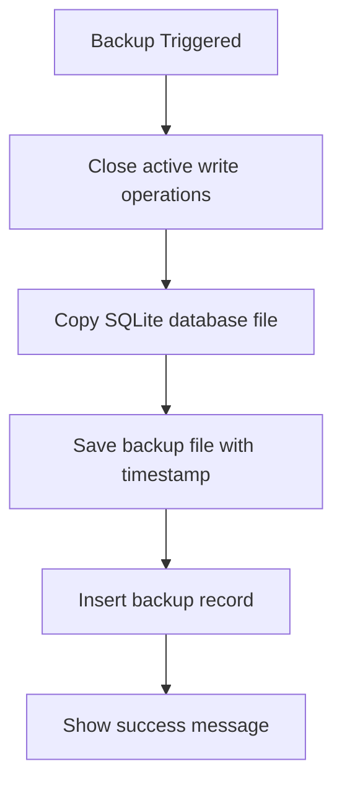
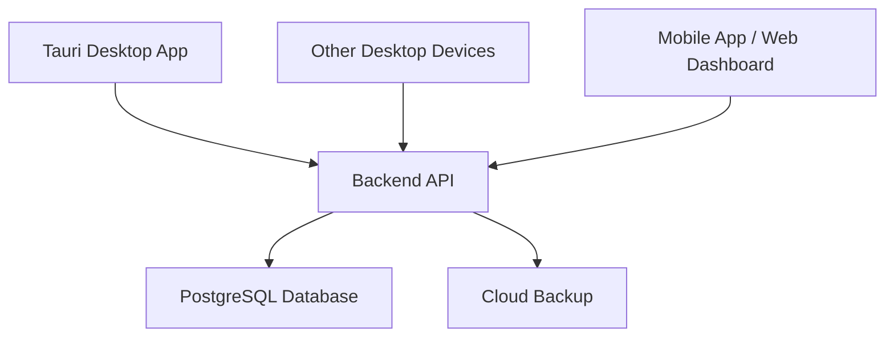
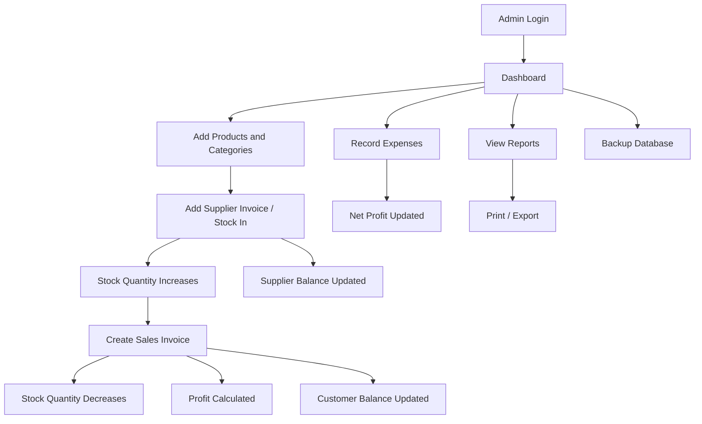

# Software Design Specification (SDS)

## Steel Inventory, Sales Invoices, and Expenses Desktop System

**Version:** 1.0  
**Status:** Approved after client confirmation  
**Prepared for:** Steel products and equipment company  
**Primary user:** One admin user  
**System type:** Offline-first desktop application  
**Date:** 2026-06-27

---

## 1. Purpose

This document describes the technical design for the steel inventory desktop system. It explains the architecture, tech stack, modules, database schema, command API, workflows, security, backup strategy, and implementation milestones.

---

## 2. Design Goals

The system should:

- Work offline without internet.
- Support one admin user in version 1.
- Store all data locally in SQLite.
- Keep stock movement accurate and auditable.
- Keep invoice and profit history correct even after price changes.
- Provide fast product search and invoice creation.
- Provide local backup and restore.
- Stay simple enough for easy client installation and maintenance.
- Allow future upgrade to cloud/backend if needed.

---

## 3. Approved Tech Stack

| Layer              | Technology                      |
| ------------------ | ------------------------------- |
| Desktop shell      | Tauri                           |
| Frontend framework | React                           |
| Frontend language  | TypeScript                      |
| UI library         | MUI                             |
| Local backend      | Rust commands inside Tauri      |
| Database           | SQLite                          |
| Database access    | SQLx or rusqlite                |
| Reports            | HTML invoice/report templates   |
| Print / PDF        | Browser print flow / PDF export |
| Installer          | Tauri Windows installer         |
| Updates            | Manual updates in version 1     |
| Backup             | Local database file backup      |

---

## 4. High-Level Architecture



Architecture explanation:

| Layer          | Responsibility                                             |
| -------------- | ---------------------------------------------------------- |
| React UI       | Screens, forms, tables, dialogs, print views               |
| Tauri commands | Secure bridge between frontend and Rust backend            |
| Rust services  | Business logic, validation, database transactions, backups |
| SQLite         | Local persistent data storage                              |
| File system    | Backups, exported invoices, exported reports               |

The frontend should not directly access SQLite. All database actions should go through Tauri commands.

---

## 5. Application Modules



Module responsibilities:

| Module     | Responsibility                               |
| ---------- | -------------------------------------------- |
| Dashboard  | Sales, profit, expenses, stock alerts, debts |
| Products   | Manage products, stock, price history        |
| Categories | Manage product categorization                |
| Suppliers  | Manage supplier profiles and balances        |
| Customers  | Manage customer profiles and balances        |
| Purchases  | Record supplier invoices and stock-in        |
| Sales      | Create customer invoices and stock-out       |
| Expenses   | Record operating expenses                    |
| Payments   | Record customer and supplier payments        |
| Reports    | Generate business reports                    |
| Settings   | Company info and system preferences          |
| Backup     | Backup and restore SQLite database           |

---

## 6. Recommended Folder Structure

```text
steel-inventory-app/
  package.json
  src/
    main.tsx
    App.tsx
    app/
      router.tsx
      layout/
        AppLayout.tsx
        Sidebar.tsx
        Topbar.tsx
    components/
      forms/
      tables/
      dialogs/
      feedback/
      print/
    features/
      auth/
      dashboard/
      categories/
      products/
      suppliers/
      customers/
      purchases/
      sales/
      expenses/
      payments/
      reports/
      settings/
      backup/
    lib/
      tauri.ts
      formatters.ts
      validators.ts
      constants.ts
    types/
      product.ts
      invoice.ts
      payment.ts
      report.ts

  src-tauri/
    tauri.conf.json
    Cargo.toml
    src/
      main.rs
      commands/
        auth_commands.rs
        category_commands.rs
        product_commands.rs
        supplier_commands.rs
        customer_commands.rs
        purchase_commands.rs
        sales_commands.rs
        expense_commands.rs
        payment_commands.rs
        report_commands.rs
        settings_commands.rs
        backup_commands.rs
      db/
        connection.rs
        migrations.rs
        schema.sql
      models/
      services/
        auth_service.rs
        inventory_service.rs
        purchase_service.rs
        sales_service.rs
        payment_service.rs
        report_service.rs
        backup_service.rs
      utils/
        money.rs
        dates.rs
        errors.rs
```

---

## 7. Navigation Design

Main sidebar menu:

```text
Dashboard
Products
Categories
Suppliers
Customers
Purchases / Stock In
Sales Invoices
Expenses
Payments
Reports
Settings
Backup
```

Layout:



---

## 8. Database Design

## 8.1 ERD



## 8.2 Database Rules

- Primary keys use `INTEGER PRIMARY KEY AUTOINCREMENT`.
- Dates are stored as ISO strings.
- Money is stored as integer cents.
- Use soft delete/archive for important records.
- Use transactions when saving invoices.
- Add indexes to search and filter columns.

---

## 9. Database Tables

## 9.1 users

| Column        | Type        | Notes                |
| ------------- | ----------- | -------------------- |
| id            | INTEGER PK  | Unique user ID       |
| full_name     | TEXT        | Admin full name      |
| email         | TEXT UNIQUE | Login email          |
| password_hash | TEXT        | Hashed password/PIN  |
| role          | TEXT        | admin                |
| is_active     | INTEGER     | 1 active, 0 inactive |
| created_at    | TEXT        | Created date         |
| updated_at    | TEXT        | Updated date         |

---

## 9.2 company_settings

| Column                  | Type       | Notes           |
| ----------------------- | ---------- | --------------- |
| id                      | INTEGER PK | Unique ID       |
| company_name            | TEXT       | Company name    |
| phone                   | TEXT       | Company phone   |
| email                   | TEXT       | Company email   |
| address                 | TEXT       | Company address |
| tax_number              | TEXT       | Optional        |
| default_currency        | TEXT       | Example: USD    |
| invoice_prefix_sales    | TEXT       | Example: SI     |
| invoice_prefix_purchase | TEXT       | Example: PI     |
| allow_negative_stock    | INTEGER    | 1 yes, 0 no     |
| backup_path             | TEXT       | Backup folder   |
| created_at              | TEXT       | Created date    |
| updated_at              | TEXT       | Updated date    |

---

## 9.3 categories

| Column      | Type         | Notes                    |
| ----------- | ------------ | ------------------------ |
| id          | INTEGER PK   | Unique category ID       |
| name        | TEXT         | Category name            |
| parent_id   | INTEGER NULL | References categories.id |
| description | TEXT         | Optional                 |
| is_active   | INTEGER      | Active status            |
| created_at  | TEXT         | Created date             |
| updated_at  | TEXT         | Updated date             |

Indexes:

```sql
CREATE INDEX idx_categories_parent_id ON categories(parent_id);
```

---

## 9.4 products

| Column       | Type        | Notes                                    |
| ------------ | ----------- | ---------------------------------------- |
| id           | INTEGER PK  | Unique product ID                        |
| sku          | TEXT UNIQUE | Product code                             |
| category_id  | INTEGER     | References categories.id                 |
| name         | TEXT        | Product name                             |
| product_type | TEXT        | pipe, sheet, equipment, accessory        |
| material     | TEXT        | steel, galvanized steel, stainless steel |
| shape        | TEXT        | square, round, rectangular, flat         |
| finish       | TEXT        | galvanized, black, painted               |
| size_label   | TEXT        | Example: 20x20                           |
| width_mm     | REAL NULL   | Product width                            |
| height_mm    | REAL NULL   | Product height                           |
| diameter_mm  | REAL NULL   | Product diameter                         |
| thickness_mm | REAL NULL   | Thickness                                |
| length_mm    | REAL NULL   | Length                                   |
| unit         | TEXT        | piece, meter, kg, sheet                  |
| description  | TEXT        | Optional                                 |
| is_active    | INTEGER     | Active status                            |
| created_at   | TEXT        | Created date                             |
| updated_at   | TEXT        | Updated date                             |

Indexes:

```sql
CREATE UNIQUE INDEX idx_products_sku ON products(sku);
CREATE INDEX idx_products_category_id ON products(category_id);
CREATE INDEX idx_products_name ON products(name);
CREATE INDEX idx_products_size_thickness ON products(size_label, thickness_mm);
```

---

## 9.5 product_prices

| Column                | Type       | Notes                    |
| --------------------- | ---------- | ------------------------ |
| id                    | INTEGER PK | Unique price ID          |
| product_id            | INTEGER    | References products.id   |
| cost_price_cents      | INTEGER    | Cost price               |
| selling_price_cents   | INTEGER    | Retail selling price     |
| wholesale_price_cents | INTEGER    | Optional wholesale price |
| currency              | TEXT       | Example: USD             |
| effective_from        | TEXT       | Date price starts        |
| created_at            | TEXT       | Created date             |

---

## 9.6 suppliers

| Column                | Type       | Notes                 |
| --------------------- | ---------- | --------------------- |
| id                    | INTEGER PK | Unique supplier ID    |
| name                  | TEXT       | Supplier/contact name |
| company_name          | TEXT       | Supplier company      |
| phone                 | TEXT       | Phone                 |
| email                 | TEXT       | Email                 |
| address               | TEXT       | Address               |
| tax_number            | TEXT       | Optional              |
| opening_balance_cents | INTEGER    | Existing balance      |
| notes                 | TEXT       | Notes                 |
| is_active             | INTEGER    | Active status         |
| created_at            | TEXT       | Created date          |
| updated_at            | TEXT       | Updated date          |

---

## 9.7 customers

| Column                | Type       | Notes                 |
| --------------------- | ---------- | --------------------- |
| id                    | INTEGER PK | Unique customer ID    |
| name                  | TEXT       | Customer/contact name |
| company_name          | TEXT       | Customer company      |
| phone                 | TEXT       | Phone                 |
| email                 | TEXT       | Email                 |
| address               | TEXT       | Address               |
| tax_number            | TEXT       | Optional              |
| opening_balance_cents | INTEGER    | Existing balance      |
| notes                 | TEXT       | Notes                 |
| is_active             | INTEGER    | Active status         |
| created_at            | TEXT       | Created date          |
| updated_at            | TEXT       | Updated date          |

---

## 9.8 purchase_invoices

| Column          | Type       | Notes                          |
| --------------- | ---------- | ------------------------------ |
| id              | INTEGER PK | Unique invoice ID              |
| supplier_id     | INTEGER    | References suppliers.id        |
| invoice_number  | TEXT       | Supplier/system invoice number |
| invoice_date    | TEXT       | Invoice date                   |
| subtotal_cents  | INTEGER    | Items total                    |
| discount_cents  | INTEGER    | Discount                       |
| tax_cents       | INTEGER    | Tax                            |
| shipping_cents  | INTEGER    | Shipping                       |
| total_cents     | INTEGER    | Final total                    |
| paid_cents      | INTEGER    | Paid amount                    |
| remaining_cents | INTEGER    | Remaining amount               |
| payment_status  | TEXT       | paid, partial, unpaid          |
| status          | TEXT       | active, cancelled              |
| notes           | TEXT       | Optional                       |
| created_by      | INTEGER    | References users.id            |
| created_at      | TEXT       | Created date                   |
| updated_at      | TEXT       | Updated date                   |

Indexes:

```sql
CREATE INDEX idx_purchase_invoices_supplier_id ON purchase_invoices(supplier_id);
CREATE INDEX idx_purchase_invoices_date ON purchase_invoices(invoice_date);
CREATE UNIQUE INDEX idx_purchase_invoice_number ON purchase_invoices(invoice_number);
```

---

## 9.9 purchase_invoice_items

| Column              | Type       | Notes                           |
| ------------------- | ---------- | ------------------------------- |
| id                  | INTEGER PK | Unique item ID                  |
| purchase_invoice_id | INTEGER    | References purchase_invoices.id |
| product_id          | INTEGER    | References products.id          |
| quantity            | REAL       | Quantity purchased              |
| unit_cost_cents     | INTEGER    | Unit cost                       |
| total_cost_cents    | INTEGER    | quantity \* unit cost           |
| created_at          | TEXT       | Created date                    |

---

## 9.10 sales_invoices

| Column          | Type         | Notes                                     |
| --------------- | ------------ | ----------------------------------------- |
| id              | INTEGER PK   | Unique invoice ID                         |
| customer_id     | INTEGER NULL | References customers.id, null for walk-in |
| invoice_number  | TEXT UNIQUE  | Sales invoice number                      |
| invoice_date    | TEXT         | Invoice date                              |
| subtotal_cents  | INTEGER      | Items total                               |
| discount_cents  | INTEGER      | Discount                                  |
| tax_cents       | INTEGER      | Tax                                       |
| delivery_cents  | INTEGER      | Delivery amount                           |
| total_cents     | INTEGER      | Final total                               |
| paid_cents      | INTEGER      | Paid amount                               |
| remaining_cents | INTEGER      | Remaining amount                          |
| payment_status  | TEXT         | paid, partial, unpaid                     |
| sales_status    | TEXT         | draft, completed, cancelled, returned     |
| notes           | TEXT         | Optional                                  |
| created_by      | INTEGER      | References users.id                       |
| created_at      | TEXT         | Created date                              |
| updated_at      | TEXT         | Updated date                              |

Indexes:

```sql
CREATE INDEX idx_sales_invoices_customer_id ON sales_invoices(customer_id);
CREATE INDEX idx_sales_invoices_date ON sales_invoices(invoice_date);
CREATE UNIQUE INDEX idx_sales_invoice_number ON sales_invoices(invoice_number);
```

---

## 9.11 sales_invoice_items

| Column            | Type       | Notes                        |
| ----------------- | ---------- | ---------------------------- |
| id                | INTEGER PK | Unique item ID               |
| sales_invoice_id  | INTEGER    | References sales_invoices.id |
| product_id        | INTEGER    | References products.id       |
| quantity          | REAL       | Quantity sold                |
| unit_cost_cents   | INTEGER    | Cost snapshot at sale time   |
| unit_price_cents  | INTEGER    | Selling price snapshot       |
| total_cost_cents  | INTEGER    | quantity \* unit cost        |
| total_price_cents | INTEGER    | quantity \* unit price       |
| profit_cents      | INTEGER    | total price - total cost     |
| created_at        | TEXT       | Created date                 |

Important rule: `unit_cost_cents` and `unit_price_cents` must be saved as snapshots so old invoices and reports stay correct after price changes.

---

## 9.12 inventory_transactions

| Column           | Type         | Notes                                       |
| ---------------- | ------------ | ------------------------------------------- |
| id               | INTEGER PK   | Unique transaction ID                       |
| product_id       | INTEGER      | References products.id                      |
| transaction_type | TEXT         | purchase, sale, return, adjustment, damaged |
| reference_type   | TEXT         | purchase_invoice, sales_invoice, manual     |
| reference_id     | INTEGER NULL | Related record ID                           |
| quantity_in      | REAL         | Stock added                                 |
| quantity_out     | REAL         | Stock removed                               |
| unit_cost_cents  | INTEGER NULL | Cost at transaction                         |
| notes            | TEXT         | Optional                                    |
| created_by       | INTEGER      | References users.id                         |
| created_at       | TEXT         | Created date                                |

Indexes:

```sql
CREATE INDEX idx_inventory_transactions_product_id ON inventory_transactions(product_id);
CREATE INDEX idx_inventory_transactions_reference ON inventory_transactions(reference_type, reference_id);
CREATE INDEX idx_inventory_transactions_created_at ON inventory_transactions(created_at);
```

---

## 9.13 stock_levels

| Column           | Type           | Notes                  |
| ---------------- | -------------- | ---------------------- |
| id               | INTEGER PK     | Unique ID              |
| product_id       | INTEGER UNIQUE | References products.id |
| current_quantity | REAL           | Current stock          |
| minimum_quantity | REAL           | Low-stock threshold    |
| updated_at       | TEXT           | Last update date       |

---

## 9.14 expense_categories

| Column      | Type       | Notes              |
| ----------- | ---------- | ------------------ |
| id          | INTEGER PK | Unique category ID |
| name        | TEXT       | Expense category   |
| description | TEXT       | Optional           |
| is_active   | INTEGER    | Active status      |
| created_at  | TEXT       | Created date       |
| updated_at  | TEXT       | Updated date       |

Default categories:

- Rent
- Electricity
- Fuel
- Delivery
- Salary
- Maintenance
- Tools
- Packaging
- Other

---

## 9.15 expenses

| Column              | Type       | Notes                            |
| ------------------- | ---------- | -------------------------------- |
| id                  | INTEGER PK | Unique expense ID                |
| expense_category_id | INTEGER    | References expense_categories.id |
| title               | TEXT       | Expense title                    |
| amount_cents        | INTEGER    | Expense amount                   |
| currency            | TEXT       | Currency                         |
| expense_date        | TEXT       | Expense date                     |
| payment_method      | TEXT       | cash, bank, card, other          |
| notes               | TEXT       | Optional                         |
| created_by          | INTEGER    | References users.id              |
| created_at          | TEXT       | Created date                     |
| updated_at          | TEXT       | Updated date                     |

---

## 9.16 payments

| Column            | Type         | Notes                             |
| ----------------- | ------------ | --------------------------------- |
| id                | INTEGER PK   | Unique payment ID                 |
| party_type        | TEXT         | customer or supplier              |
| party_id          | INTEGER      | Customer ID or supplier ID        |
| payment_direction | TEXT         | in or out                         |
| amount_cents      | INTEGER      | Payment amount                    |
| currency          | TEXT         | Currency                          |
| payment_method    | TEXT         | cash, bank, card, other           |
| payment_date      | TEXT         | Payment date                      |
| reference_type    | TEXT NULL    | sales_invoice or purchase_invoice |
| reference_id      | INTEGER NULL | Related invoice ID                |
| notes             | TEXT         | Optional                          |
| created_by        | INTEGER      | References users.id               |
| created_at        | TEXT         | Created date                      |

Business meaning:

| Scenario              | party_type | payment_direction |
| --------------------- | ---------- | ----------------- |
| Customer paid company | customer   | in                |
| Company paid supplier | supplier   | out               |

---

## 9.17 audit_logs

| Column         | Type       | Notes                                 |
| -------------- | ---------- | ------------------------------------- |
| id             | INTEGER PK | Unique log ID                         |
| user_id        | INTEGER    | References users.id                   |
| action         | TEXT       | create, update, delete, cancel, login |
| table_name     | TEXT       | Affected table                        |
| record_id      | INTEGER    | Affected record ID                    |
| old_value_json | TEXT       | Before state                          |
| new_value_json | TEXT       | After state                           |
| created_at     | TEXT       | Log date                              |

---

## 9.18 backups

| Column      | Type       | Notes               |
| ----------- | ---------- | ------------------- |
| id          | INTEGER PK | Unique backup ID    |
| backup_path | TEXT       | File path           |
| backup_type | TEXT       | manual or automatic |
| status      | TEXT       | success or failed   |
| notes       | TEXT       | Optional            |
| created_at  | TEXT       | Backup date         |

---

## 10. Key Business Processes

## 10.1 Purchase Invoice Save Process



## 10.2 Sales Invoice Save Process



## 10.3 Expense Save Process



## 10.4 Backup Process



---

## 11. Tauri Command API Design

Frontend wrapper example:

```ts
import { invoke } from "@tauri-apps/api/core";

export async function listProducts(filters: ProductFilters) {
  return invoke<Product[]>("list_products", { filters });
}
```

### Auth Commands

```text
login_admin(payload)
change_admin_password(payload)
get_current_admin()
```

### Category Commands

```text
create_category(payload)
update_category(id, payload)
archive_category(id)
list_categories()
```

### Product Commands

```text
create_product(payload)
update_product(id, payload)
archive_product(id)
get_product(id)
list_products(filters)
get_product_stock(product_id)
get_product_movement(product_id, filters)
```

### Supplier Commands

```text
create_supplier(payload)
update_supplier(id, payload)
archive_supplier(id)
get_supplier(id)
list_suppliers(filters)
get_supplier_statement(supplier_id, filters)
```

### Customer Commands

```text
create_customer(payload)
update_customer(id, payload)
archive_customer(id)
get_customer(id)
list_customers(filters)
get_customer_statement(customer_id, filters)
```

### Purchase Commands

```text
create_purchase_invoice(payload)
cancel_purchase_invoice(id)
get_purchase_invoice(id)
list_purchase_invoices(filters)
print_purchase_invoice(id)
```

### Sales Commands

```text
create_sales_invoice(payload)
cancel_sales_invoice(id)
get_sales_invoice(id)
list_sales_invoices(filters)
print_sales_invoice(id)
```

### Expense Commands

```text
create_expense(payload)
update_expense(id, payload)
delete_expense(id)
list_expenses(filters)
```

### Payment Commands

```text
create_payment(payload)
delete_payment(id)
list_payments(filters)
```

### Report Commands

```text
get_dashboard_summary(date)
get_daily_sales_report(filters)
get_profit_report(filters)
get_stock_report(filters)
get_low_stock_report()
get_customer_debt_report(filters)
get_supplier_debt_report(filters)
get_expense_report(filters)
get_inventory_value_report()
```

### Settings and Backup Commands

```text
get_company_settings()
update_company_settings(payload)
create_manual_backup()
restore_backup(path)
list_backups()
```

---

## 12. Frontend Screen Design

## Dashboard Screen

Widgets:

- Today's sales
- Today's profit
- Today's expenses
- Net profit
- Customer debts
- Supplier debts
- Low-stock products
- Recent invoices

## Products Screen

Components:

- Search input
- Category filter
- Products table
- Add/edit product dialog
- Stock movement button
- Price history panel

## Purchases Screen

Components:

- Purchase invoice list
- New purchase invoice form
- Supplier selector
- Product selector
- Invoice items table
- Totals summary
- Paid amount field
- Save and print buttons

## Sales Screen

Components:

- Sales invoice list
- New sales invoice form
- Customer selector
- Product search
- Invoice items table
- Stock availability display
- Totals summary
- Paid amount field
- Save and print buttons

## Expenses Screen

Components:

- Expense list
- Date filters
- Category filter
- Add/edit expense dialog

## Reports Screen

Components:

- Report selector
- Date range filters
- Report table
- Print/export buttons

---

## 13. Validation Rules

## Product Validation

- SKU is required and unique.
- Product name is required.
- Category is required.
- Unit is required.
- Thickness, width, height, diameter, and length must be positive when provided.
- Prices must be zero or positive.

## Purchase Invoice Validation

- Supplier is required.
- Invoice date is required.
- At least one item is required.
- Quantity must be greater than zero.
- Unit cost must be zero or greater.
- Paid amount cannot exceed total amount.

## Sales Invoice Validation

- Invoice date is required.
- At least one item is required.
- Quantity must be greater than zero.
- Unit price must be zero or greater.
- Paid amount cannot exceed total amount.
- Stock must be available unless negative stock is enabled.

## Expense Validation

- Expense category is required.
- Title is required.
- Amount must be greater than zero.
- Expense date is required.

## Payment Validation

- Party type is required.
- Party ID is required.
- Amount must be greater than zero.
- Payment date is required.
- Payment direction must match party type.

---

## 14. Money Handling

Money values must be stored as integer cents.

| Display Value | Stored Value |
| ------------: | -----------: |
|         17.00 |         1700 |
|     17,000.00 |      1700000 |
|      3,800.50 |       380050 |

This avoids floating-point rounding issues and keeps reports accurate.

---

## 15. Stock Calculation Rules

Current stock is stored in `stock_levels.current_quantity`.

All stock movements are stored in `inventory_transactions`.

Formula:

```text
Current Stock = Opening Stock + Purchases + Returns In + Adjustments In
                - Sales - Supplier Returns - Damaged - Adjustments Out
```

Rules:

- Purchase invoice creates quantity_in.
- Sales invoice creates quantity_out.
- Stock update must happen in the same database transaction as invoice save.

---

## 16. Profit Calculation Rules

Profit is calculated at invoice item level.

```text
Item Profit = Total Selling Price - Total Cost
Total Selling Price = Quantity * Unit Selling Price
Total Cost = Quantity * Unit Cost
```

The system must store:

- `unit_cost_cents`
- `unit_price_cents`
- `total_cost_cents`
- `total_price_cents`
- `profit_cents`

This keeps old profit reports correct even when product cost changes later.

---

## 17. Reporting Design

## Dashboard Summary

Input:

- Date

Output:

- Total sales
- Total paid
- Total remaining
- Total expenses
- Gross profit
- Net profit
- Low-stock count

## Daily Sales Report

Source tables:

- sales_invoices
- sales_invoice_items
- products
- customers

## Profit Report

Source tables:

- sales_invoice_items
- sales_invoices
- expenses

## Stock Report

Source tables:

- products
- stock_levels
- product_prices

## Debt Reports

Customer debt:

```text
customers.opening_balance + sales invoice remaining amounts - customer payments
```

Supplier debt:

```text
suppliers.opening_balance + purchase invoice remaining amounts - supplier payments
```

---

## 18. Invoice Print Design

Invoices should be generated from HTML templates.

Sales invoice fields:

- Company name
- Company address
- Company phone
- Invoice number
- Invoice date
- Customer name
- Customer phone
- Product rows
- Quantity
- Unit price
- Row total
- Subtotal
- Discount
- Delivery
- Total
- Paid
- Remaining
- Notes

Purchase invoice fields:

- Company name
- Supplier name
- Supplier invoice number
- Invoice date
- Product rows
- Quantity
- Unit cost
- Row total
- Subtotal
- Discount
- Shipping
- Total
- Paid
- Remaining
- Notes

---

## 19. Backup and Restore Design

Backup file naming:

```text
steel_inventory_backup_YYYY-MM-DD_HH-mm-ss.db
```

Default backup path:

```text
Documents/SteelInventoryBackups/
```

Backup rules:

- Create manual backup on admin request.
- Create one automatic backup per day.
- Store backup record in `backups` table.
- Before restore, create emergency backup of current database.
- Restart app after restore.

---

## 20. Security Design

Security requirements:

- Admin password/PIN must be hashed.
- No plain text password storage.
- Frontend cannot access SQLite directly.
- All writes go through Rust/Tauri commands.
- Validate all input before database write.
- Confirm sensitive actions.

Sensitive actions that require confirmation:

- Delete expense
- Cancel invoice
- Restore backup
- Archive product
- Archive supplier
- Archive customer
- Change settings

---

## 21. Error Handling

Rust backend should return structured errors.

Example:

```json
{
  "code": "INSUFFICIENT_STOCK",
  "message": "Not enough stock available for this product."
}
```

Common error codes:

```text
VALIDATION_ERROR
NOT_FOUND
DUPLICATE_SKU
DUPLICATE_INVOICE_NUMBER
INSUFFICIENT_STOCK
DATABASE_ERROR
BACKUP_FAILED
RESTORE_FAILED
UNAUTHORIZED
```

Frontend should display clear messages to the admin.

---

## 22. Testing Plan

## Unit Tests

Test:

- Money calculations
- Stock calculations
- Profit calculations
- Validation rules
- Invoice totals

## Integration Tests

Test:

- Create purchase invoice and stock increases
- Create sales invoice and stock decreases
- Partial customer payment
- Supplier payment
- Expense creation
- Backup creation

## Manual QA Scenarios

- Add product
- Add supplier
- Add customer
- Enter stock-in invoice
- Sell product
- Check stock movement
- Record expense
- Check daily profit
- Print invoice
- Backup database
- Restore database

---

## 23. Deployment Design

Version 1 will be delivered as a Windows installer.

Build command:

```text
tauri build
```

Expected output:

- `.msi` or `.exe` installer depending on selected Tauri bundler

Manual update process:

1. Developer builds new installer.
2. Developer sends installer to client.
3. Client installs update.
4. Database remains in the app data folder.
5. Backup is created before update.

Auto-updater can be added later.

---

## 24. Migration Strategy

Database changes should use migrations.

Example migration files:

```text
001_initial_schema.sql
002_add_product_prices.sql
003_add_backup_logs.sql
```

The app should run pending migrations on startup.

---

## 25. Future Upgrade Path

If the client later needs multiple computers or remote access, the system can evolve to:



Future stack:

| Layer    | Technology                |
| -------- | ------------------------- |
| Desktop  | Tauri + React             |
| Backend  | FastAPI or NestJS         |
| Database | PostgreSQL                |
| Auth     | Backend authentication    |
| Sync     | API-based synchronization |
| Hosting  | VPS or cloud provider     |

---

## 26. Implementation Milestones

## Milestone 1: Project Setup

- Create Tauri + React + TypeScript project
- Install MUI
- Setup SQLite connection
- Setup migrations
- Setup app layout

## Milestone 2: Master Data

- Categories
- Products
- Suppliers
- Customers
- Settings

## Milestone 3: Inventory and Purchases

- Purchase invoices
- Purchase invoice items
- Stock-in transactions
- Stock levels

## Milestone 4: Sales

- Sales invoices
- Sales invoice items
- Stock-out transactions
- Profit snapshots
- Invoice print layout

## Milestone 5: Expenses and Payments

- Expense categories
- Expenses
- Customer payments
- Supplier payments

## Milestone 6: Reports

- Dashboard
- Sales reports
- Profit reports
- Stock reports
- Debt reports
- Expense reports

## Milestone 7: Backup and Final QA

- Backup
- Restore
- Installer
- Manual QA
- Client testing

---

## 27. Design Decisions Summary

| Decision          | Choice                                | Reason                             |
| ----------------- | ------------------------------------- | ---------------------------------- |
| Desktop framework | Tauri                                 | Lightweight modern desktop app     |
| Frontend          | React + TypeScript                    | Reusable UI and strong typing      |
| UI library        | MUI                                   | Ready business components          |
| Database          | SQLite                                | Offline, local, simple             |
| Backend logic     | Rust/Tauri commands                   | Secure local database access       |
| Money storage     | Integer cents                         | Accurate calculations              |
| Stock tracking    | Inventory transactions + stock levels | Auditability and performance       |
| User model        | Single admin                          | Matches current client requirement |
| Updates           | Manual first                          | Simpler for version 1              |
| Backup            | Local daily backup                    | Reduces data-loss risk             |

---

## 28. Final System Flow


