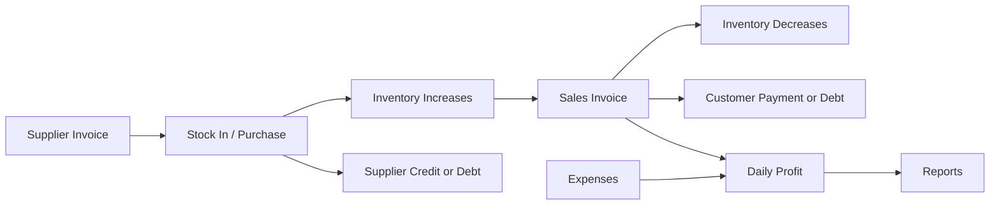
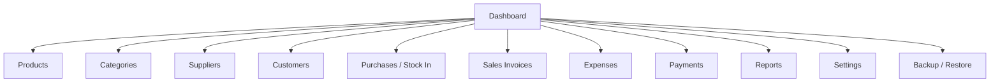
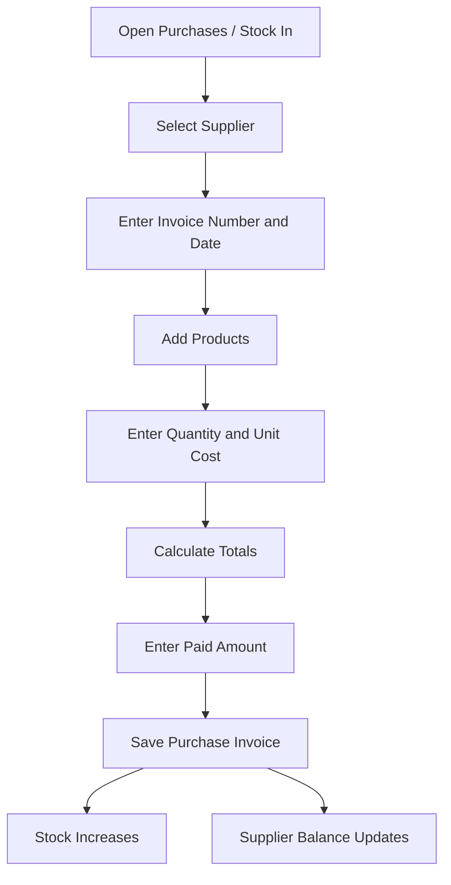
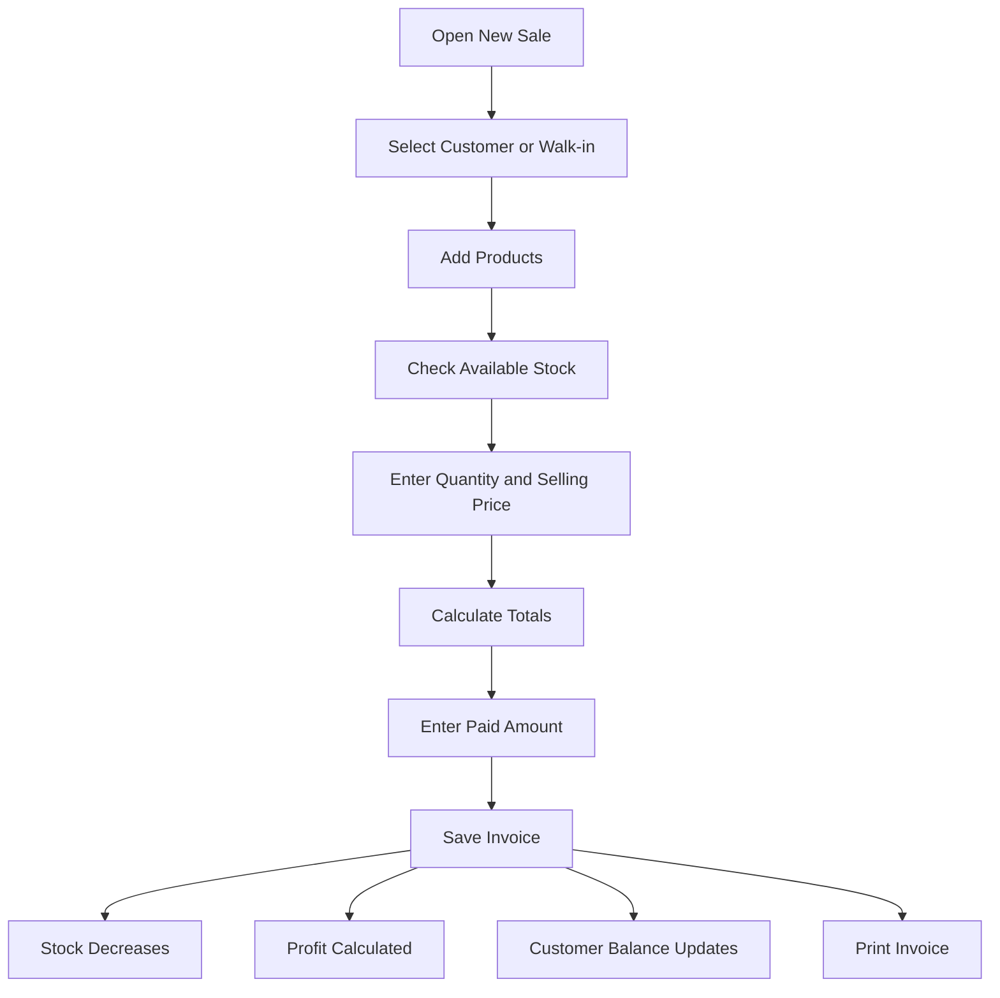

# Software Requirements Specification (SRS)

## Steel Inventory, Sales Invoices, and Expenses Desktop System

**Version:** 1.0  
**Status:** Approved after client confirmation  
**Prepared for:** Steel products and equipment company  
**Primary user:** One admin user  
**System type:** Offline-first desktop application  
**Date:** 2026-06-27

---

## 1. Purpose

This document defines the requirements for a desktop system that manages inventory, stock-in, sales invoices, expenses, customer credits, supplier credits, payments, profit, and reports for a company that sells steel products and equipment.

The system is designed for **one user only** in version 1. This user is the **admin** and has full responsibility for all operations.

---

## 2. Scope

The application will be installed locally on the admin's desktop computer. It will work offline and store all data locally.

The system will support this business flow:



---

## 3. Business Context

The company buys steel products and equipment from suppliers and sells them to customers. Supplier invoices usually contain product size, thickness, quantity, unit price, and total.

Example supplier invoice item:

| Size  | Thickness | Quantity | Unit Price |     Total |
| ----- | --------: | -------: | ---------: | --------: |
| 20x20 |     0.5mm |    1,000 |      17.00 | 17,000.00 |
| 20x20 |     1.5mm |      100 |      38.00 |  3,800.00 |
| 25x25 |     0.5mm |    1,000 |      24.00 | 24,000.00 |

The admin needs to track daily sales, remaining stock, daily profit, expenses, supplier credits, customer balances, and invoices.

---

## 4. Stakeholders

| Stakeholder   | Description                                                       |
| ------------- | ----------------------------------------------------------------- |
| Admin / Owner | The only user in version 1. Has full access to the system.        |
| Suppliers     | Companies that sell steel products and equipment to the business. |
| Customers     | People or companies buying products from the business.            |
| Developer     | Builds, supports, and updates the system.                         |

---

## 5. User Role

## 5.1 Current Role

| Role  | Description                        | Access                    |
| ----- | ---------------------------------- | ------------------------- |
| Admin | Main operator and owner-level user | Full access to everything |

The system does not need multiple roles in version 1. However, the design should not block future roles such as cashier, accountant, warehouse user, or viewer.

---

## 6. System Modules



Main modules:

1. Dashboard
2. Products and categories
3. Suppliers
4. Customers
5. Purchases / stock-in
6. Sales invoices
7. Expenses
8. Payments
9. Reports
10. Settings
11. Backup and restore

---

## 7. Functional Requirements

## FR-001: Admin Login

The system shall provide a local login screen for the admin.

Requirements:

- Admin can log in using email/username and password or PIN.
- Password/PIN must not be stored as plain text.
- Invalid login must block access.
- Version 1 supports only one active admin account.

Acceptance criteria:

- Admin can access the app after valid login.
- Invalid credentials show an error.
- Business data is not accessible before login.

---

## FR-002: Dashboard

The system shall show a business summary on the dashboard.

Dashboard cards:

- Today's sales
- Today's profit
- Today's expenses
- Net profit
- Total customer debts
- Total supplier debts
- Low-stock products
- Current stock value
- Recent sales invoices
- Recent purchase invoices

Acceptance criteria:

- Dashboard updates after purchases, sales, expenses, and payments.
- Admin can understand the current business status quickly.

---

## FR-003: Categories

The system shall allow the admin to manage product categories.

Admin can:

- Add category
- Edit category
- Archive category
- Create parent and child categories
- View categories in a tree or table

Suggested category structure:

```text
Steel Products
  Pipes
    Galvanized Pipes
      Square Pipes
      Rectangular Pipes
      Round Pipes
    Black Pipes
      Square Pipes
      Rectangular Pipes
      Round Pipes
  Sheets / Plates
    Galvanized Sheets
    Black Sheets
    Stainless Steel Sheets
  Bars
    Flat Bars
    Round Bars
    Square Bars
  Angles / Channels / Beams
    Angle Bar
    U Channel
    I Beam
    H Beam
  Rebar
  Accessories
  Equipment
```

---

## FR-004: Products

The system shall allow the admin to manage products.

Admin can:

- Add product
- Edit product
- Archive product
- Search product by name, SKU, size, thickness, category, or material
- Filter products by category
- View current stock
- View product movement history
- View price history

Product data:

- SKU
- Product name
- Category
- Product type
- Material
- Shape
- Finish
- Size label
- Width
- Height
- Diameter
- Thickness
- Length
- Unit
- Cost price
- Selling price
- Wholesale price
- Minimum stock quantity
- Active status

Example:

```text
SKU: GSP-SQ-20X20-0.5
Name: Galvanized Square Pipe 20x20 0.5mm
Category: Galvanized Square Pipes
Material: Steel
Shape: Square
Finish: Galvanized
Size: 20x20
Thickness: 0.5mm
Unit: Piece
```

---

## FR-005: SKU Generation

The system should generate SKU codes automatically.

Example:

```text
GSP-SQ-20X20-0.5
```

Meaning:

```text
Galvanized Steel Pipe - Square - 20x20 - 0.5mm
```

Rules:

- SKU must be unique.
- Duplicate SKU is not allowed.
- Admin can manually edit the generated SKU if needed.

---

## FR-006: Suppliers

The system shall allow the admin to manage suppliers.

Admin can:

- Add supplier
- Edit supplier
- Archive supplier
- View supplier profile
- View purchase history
- View supplier payments
- View supplier remaining balance

Supplier fields:

- Name
- Company name
- Phone
- Email
- Address
- Tax number
- Opening balance
- Notes

---

## FR-007: Customers

The system shall allow the admin to manage customers.

Admin can:

- Add customer
- Edit customer
- Archive customer
- View customer profile
- View sales history
- View customer payments
- View customer remaining balance

Customer fields:

- Name
- Company name
- Phone
- Email
- Address
- Tax number
- Opening balance
- Notes

The system shall also support walk-in customers.

---

## FR-008: Purchases / Stock In

The system shall allow the admin to record supplier invoices and increase stock.

Workflow:



Admin can:

- Create purchase invoice
- Select supplier
- Add invoice number
- Add invoice date
- Add multiple products
- Enter quantity and unit cost
- Add discount
- Add shipping amount
- Add paid amount
- Save as paid, partial, or unpaid
- Print or export purchase invoice
- View purchase history

Business rules:

- Saving a purchase invoice increases stock.
- If paid amount is less than invoice total, supplier debt increases.
- Unit cost must be saved on the invoice item.
- Stock changes must be recorded in inventory transactions.

---

## FR-009: Sales Invoices

The system shall allow the admin to create sales invoices and decrease stock.

Workflow:



Admin can:

- Create sales invoice
- Select customer or walk-in customer
- Add multiple products
- Search products quickly
- View available stock before selling
- Enter quantity
- Enter selling price
- Add discount
- Add delivery amount
- Add paid amount
- Save as paid, partial, or unpaid
- Print invoice
- View sales invoice history
- Cancel invoice if needed

Business rules:

- Sale decreases stock.
- System should block selling more than available stock unless negative stock is enabled in settings.
- Profit is calculated using cost price snapshot at the time of sale.
- Old invoices must not change when product prices change later.
- If paid amount is less than total, customer balance increases.

---

## FR-010: Inventory Transactions

The system shall record every stock movement.

Transaction types:

- Opening stock
- Purchase
- Sale
- Customer return
- Supplier return
- Adjustment in
- Adjustment out
- Damaged stock

Each transaction must store:

- Product
- Transaction type
- Quantity in
- Quantity out
- Unit cost
- Reference type
- Reference ID
- Date
- Notes
- Created by

Acceptance criteria:

- Admin can see why stock changed.
- Current stock can be traced from transaction history.

---

## FR-011: Stock Levels

The system shall store current stock for each product.

Stock level data:

- Product
- Current quantity
- Minimum quantity
- Last updated date

Rules:

- Purchase increases stock.
- Sale decreases stock.
- Adjustment modifies stock.
- Low-stock alert appears when current quantity is less than or equal to minimum quantity.

---

## FR-012: Expenses

The system shall allow the admin to record business expenses.

Expense examples:

- Rent
- Electricity
- Fuel
- Delivery
- Salary
- Maintenance
- Tools
- Packaging
- Machine repair
- Other

Admin can:

- Add expense
- Edit expense
- Delete expense if entered by mistake
- Select expense category
- Enter amount
- Select payment method
- Add date
- Add notes
- Filter expenses by date/category

---

## FR-013: Payments

The system shall record customer and supplier payments.

Payment types:

| Payment          | Direction |
| ---------------- | --------- |
| Customer payment | Money in  |
| Supplier payment | Money out |

Admin can:

- Add customer payment
- Add supplier payment
- Link payment to invoice if needed
- Record payment method
- Add payment date
- Add notes
- View payment history

Rules:

- Customer payment decreases customer debt.
- Supplier payment decreases supplier debt.
- Payment can be linked to an invoice or saved as a general payment.

---

## FR-014: Customer Statement

The system shall generate a customer statement.

Statement includes:

- Opening balance
- Sales invoices
- Payments
- Remaining balance
- Date range filter

Example:

| Date       | Type    | Reference |  Debit | Credit | Balance |
| ---------- | ------- | --------- | -----: | -----: | ------: |
| 2026-06-21 | Invoice | SI-1001   | 500.00 |   0.00 |  500.00 |
| 2026-06-22 | Payment | PAY-1001  |   0.00 | 200.00 |  300.00 |

---

## FR-015: Supplier Statement

The system shall generate a supplier statement.

Statement includes:

- Opening balance
- Purchase invoices
- Supplier payments
- Remaining balance
- Date range filter

---

## FR-016: Reports

The system shall provide reports for business tracking.

Required reports:

- Daily sales report
- Daily profit report
- Monthly profit report
- Stock remaining report
- Stock movement report
- Low-stock report
- Purchase report
- Supplier debt report
- Customer debt report
- Expense report
- Payment report
- Inventory value report
- Best-selling products report

Report filters:

- Date range
- Product
- Category
- Supplier
- Customer
- Payment status

---

## FR-017: Invoice Printing and PDF Export

The system shall allow the admin to print and export invoices.

Invoice should include:

- Company name
- Company phone/address
- Invoice number
- Invoice date
- Customer or supplier name
- Product details
- Quantity
- Unit price
- Total
- Discount
- Paid amount
- Remaining amount
- Notes

Supported output:

- Print
- PDF export

---

## FR-018: Settings

The system shall provide settings for the admin.

Settings include:

- Company name
- Company phone
- Company address
- Default currency
- Invoice numbering format
- Allow/block negative stock
- Backup location
- Default tax value if needed
- Default profit calculation method

---

## FR-019: Backup and Restore

The system shall provide backup and restore.

Requirements:

- Manual backup button
- Automatic daily backup
- Backup SQLite database file to selected folder
- Restore from backup file
- Show last backup date
- Confirm before restoring

Acceptance criteria:

- Admin can create backup successfully.
- Admin can restore from backup.
- Backup process does not interrupt daily work.

---

## FR-020: Audit Log

The system should track important actions.

Tracked actions:

- Product created/updated/archived
- Purchase invoice created/cancelled
- Sales invoice created/cancelled
- Expense created/updated/deleted
- Payment created/deleted
- Backup created/restored
- Settings updated

---

## 8. Non-Functional Requirements

## NFR-001: Offline-first

The app must work without internet.

## NFR-002: Performance

Target performance:

- Dashboard loads within 2 seconds.
- Product search feels instant for normal inventory size.
- Invoice save completes within 2 seconds for normal invoices.

## NFR-003: Reliability

The app must avoid data loss.

Requirements:

- Use database transactions for invoices.
- Do not update stock unless invoice save succeeds.
- Daily backup should be available.

## NFR-004: Security

Requirements:

- Local login required.
- Password/PIN hashed.
- Frontend must not directly access the database file.
- Sensitive actions require confirmation.

## NFR-005: Usability

The app should be simple for non-technical daily use.

Requirements:

- Clear sidebar navigation
- Fast product search
- Simple invoice forms
- Clear totals
- Confirmation before dangerous actions
- Clean invoice print layout

## NFR-006: Maintainability

The codebase should use:

- TypeScript
- Clear feature-based structure
- Reusable components
- Database migrations
- Centralized validation
- Clear naming conventions

## NFR-007: Compatibility

Version 1 targets Windows desktop.

---

## 9. Approved Tech Stack

| Layer               | Technology                        |
| ------------------- | --------------------------------- |
| Desktop framework   | Tauri                             |
| Frontend            | React                             |
| Language            | TypeScript                        |
| UI library          | MUI                               |
| Local backend logic | Rust commands inside Tauri        |
| Database            | SQLite                            |
| Database access     | SQLx or rusqlite                  |
| Reports / invoices  | HTML templates + print/PDF export |
| Build output        | Windows installer                 |
| Updates             | Manual updates in version 1       |
| Backup              | Local SQLite database backup      |

Reason for this stack:

- One admin user only.
- Offline-first desktop system.
- SQLite is enough for a local single-user app.
- Tauri creates lightweight desktop apps.
- React + MUI is strong for business screens, tables, forms, and invoices.
- No backend server is needed in version 1.

---

## 10. Data Requirements Summary

Main entities:

- Users
- Company settings
- Categories
- Products
- Product prices
- Suppliers
- Customers
- Purchase invoices
- Purchase invoice items
- Sales invoices
- Sales invoice items
- Inventory transactions
- Stock levels
- Expense categories
- Expenses
- Payments
- Audit logs
- Backups

---

## 11. Business Rules Summary

- One admin user has full access.
- Purchases increase stock.
- Sales decrease stock.
- Expenses reduce net profit.
- Unpaid sales create customer debt.
- Unpaid purchases create supplier debt.
- Payments reduce customer or supplier debt.
- Profit is calculated from invoice item snapshots.
- Stock changes must always be recorded as transactions.
- Old invoices must not change when product prices change.
- Backup should be created daily.

---

## 12. Out of Scope for Version 1

The following are not included in version 1:

- Multi-user permissions
- Cloud sync
- Web dashboard
- Mobile app
- Barcode scanner integration
- Online customer ordering
- Multiple branches
- Multi-device synchronization
- Full accounting ledger
- Tax authority integration
- Supplier invoice OCR

---

## 13. Future Enhancements

Possible future features:

- Barcode scanning
- Excel import for supplier invoices
- Cloud backup
- Multi-user accounts
- Role permissions
- Multi-device sync
- Mobile reporting app
- Supplier invoice OCR
- Advanced accounting module
- Product image support
- WhatsApp invoice sharing

---

## 14. MVP Delivery Scope

The MVP should include:

1. Local admin login
2. Dashboard
3. Product categories
4. Products
5. Suppliers
6. Customers
7. Purchases / stock-in
8. Sales invoices
9. Expenses
10. Payments
11. Stock movement tracking
12. Reports
13. Invoice printing/PDF export
14. Settings
15. Backup and restore

---

## 15. Acceptance Summary

The system is accepted when the admin can:

- Add products and categories
- Add suppliers and customers
- Enter supplier purchase invoices
- Automatically increase stock
- Create sales invoices
- Automatically decrease stock
- Record expenses
- Track customer and supplier balances
- View daily sales and profit
- Print invoices
- Export reports
- Backup and restore the database
